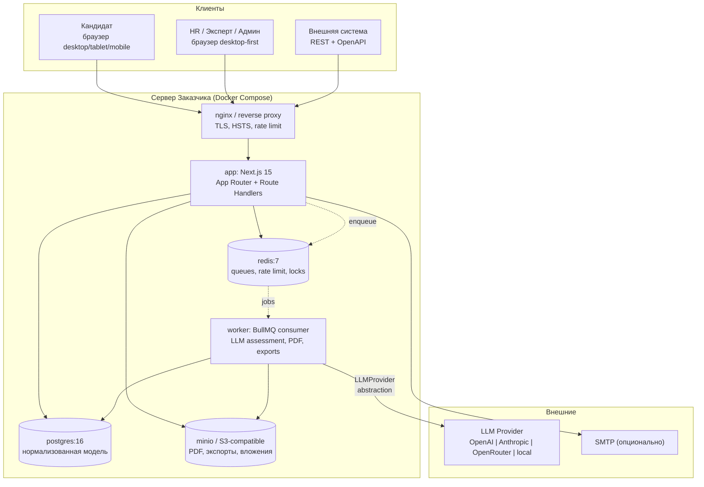
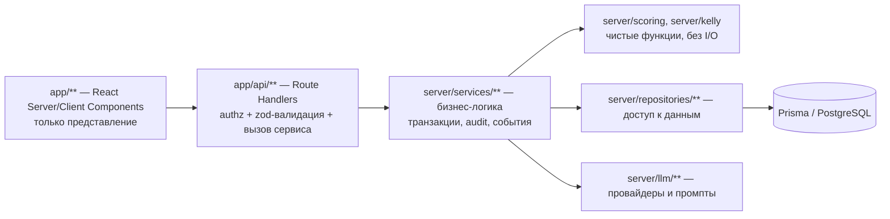
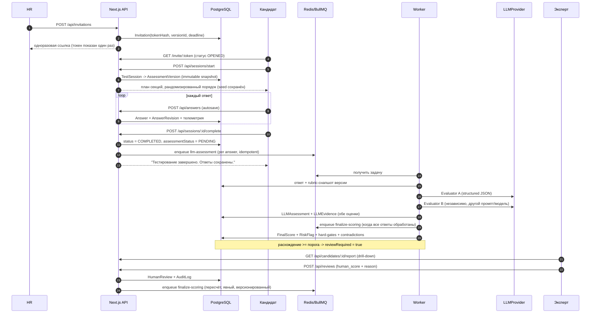

# ARCHITECTURE

## 1. Ключевые архитектурные решения (ADR-сводка)

| # | Решение | Обоснование | Отвергнутая альтернатива |
|---|---|---|---|
| ADR-1 | **Модульный монолит на Next.js 15 (App Router) + отдельный worker-процесс** | Развёртывание на собственном сервере Заказчика силами его IT; один артефакт, одна БД, минимум операционной сложности. Границы модулей соблюдаются на уровне слоёв (`app → services → repositories → prisma`), а не сети. | Отдельный API-сервис (NestJS): +1 деплой, +1 контракт, без выгоды при данном профиле нагрузки. Микросервисы — неоправданны. |
| ADR-2 | **Route Handlers (`/api/*`) как единственный транспорт**, Server Actions не используются для мутаций данных | Один контракт для UI, интеграций и тестов; OpenAPI-документируемость; тестируемость без браузера. | Server Actions — недокументируемы в OpenAPI, тяжело тестировать как API. |
| ADR-3 | **PostgreSQL 16 + Prisma** | Нормализованная модель, транзакции, FTS (`russian`), JSONB для версионируемых снапшотов rubric. | MongoDB — теряем целостность оценок; Drizzle — меньше зрелости миграций для этой команды. |
| ADR-4 | **Session-based auth, opaque token, argon2id** | Нет JWT-инвалидации, простая ревокация, безопасные cookie. | JWT — проблема revocation при увольнении/компромате. |
| ADR-5 | **BullMQ + Redis для очередей** | LLM-оценка и PDF долгие и падающие; нужен retry/backoff/DLQ и независимость от отказа LLM. | Синхронная оценка — теряем сессии при отказе LLM (нарушение §74). |
| ADR-6 | **Scoring — чистый детерминированный модуль без I/O** | §60/§73: детерминизм и unit-тестируемость; LLM-компонент версионируется отдельно. | Скоринг внутри промпта — невоспроизводим и непроверяем. |
| ADR-7 | **LLM возвращает только per-answer суждения, агрегацию делает код** | §2: итоговая оценка не формируется одним LLM-запросом. | Один «финальный» запрос — непрозрачно, невоспроизводимо. |
| ADR-8 | **Свои SVG-компоненты графиков** | Полный контроль над цветовой семантикой (§51: красный только для техпредупреждений), обязательный табличный эквивалент, отсутствие тяжёлых зависимостей, SSR-friendly для PDF. | Recharts/Chart.js — canvas/DOM-зависимости, хуже для PDF и a11y. |
| ADR-9 | **PDF = headless Chromium печатает web-report** | Кириллица, единый источник вёрстки для web и PDF, никакого дублирования шаблонов. | pdfkit/pdf-lib — ручные шрифты и вторая вёрстка отчёта. |
| ADR-10 | **Prisma-схема с `AssessmentVersion` snapshot-полями (JSONB)** | Immutability и воспроизводимость: версия хранит зафиксированный набор вопросов, весов и rubric. | Пересчёт по «живым» справочникам — нарушение §32/§36. |

## 2. Контекстная диаграмма



## 3. Слои и правила зависимостей



**Жёсткие правила (проверяются ESLint-правилом `no-restricted-imports`):**
* `app/**` не импортирует `@prisma/client` напрямую — только через сервисы;
* `server/scoring/**` и `server/kelly/**` не импортируют ничего из `server/db`,
  `server/llm`, `next/*` — это гарантия детерминизма и тестируемости;
* `server/repositories/**` — единственное место с `prisma.*`;
* LLM-вызовы только из `server/llm/**`, вызываются только из worker-задач;
* компонент UI > 300 строк или смешивающий бизнес-логику — code smell,
  вынос логики в `lib/` или сервис.

## 4. Структура модулей

```
src/
  app/
    (public)/                     страница входа, приглашение кандидата
    (candidate)/t/[sessionId]/    движок теста: секции, автосохранение
    (admin)/
      dashboard/                  HR dashboard
      candidates/[id]/            карточка кандидата + drill-down
      review/                     очередь human review
      compare/                    сравнение до 5 кандидатов
      analytics/                  аналитика, качество вопросов
      calibration/                LLM vs human
      builder/                    конструктор ассессментов
      users/  audit/  settings/
    api/**                        REST + OpenAPI
  components/
    ui/                           примитивы (Button, Table, Field, Dialog…)
    charts/                       Radar, Bar, Heatmap, Scatter, Distribution + TableFallback
    candidate/                    Triad, Grid, Ladder, CaseStage, SelfRating
    report/                       секции отчёта (переиспользуются web + PDF)
  server/
    auth/                         password, session, rbac, permissions
    db/                           prisma client, transaction helper
    repositories/                 typed data access
    services/                     assessment, invitation, testSession, answer,
                                  kelly, scoring, review, report, interviewQuestions,
                                  analytics, calibration, benchmark, export, search,
                                  audit, retention, user
    scoring/                      pure engine (§73) + rubric evaluation
    kelly/                        grid math, similarity, clustering, laddering
    llm/                          provider abstraction, prompts, schemas, evaluator
    queue/                        bullmq queues + job definitions
    http/                         route wrapper, errors, rate limit, request-id
    validation/                   zod schemas (single source for API + OpenAPI)
    logging/                      pino structured logger
    config/                       env validation (zod), feature flags
  lib/                            изоморфные утилиты, i18n-словарь, форматирование
worker/
  index.ts                        BullMQ worker bootstrap
  jobs/                           llmAssessment, finalizeScoring, generatePdf, export
prisma/
  schema.prisma  migrations/  seed/
tests/
  unit/ integration/ api/ permissions/ scoring/ llm/ e2e/
```

## 5. Поток данных: от приглашения до отчёта



## 6. Модель безопасности потоков

* **Кандидатская сессия** живёт в отдельном cookie (`nestro_cand`) с иным
  namespace, чем staff-сессия (`nestro_sid`). Кандидатский cookie даёт доступ
  строго к `/api/sessions/:id/*` и `/api/answers` собственной сессии.
* **Ответ кандидата — недоверенные данные.** В LLM он попадает только внутри
  секции `<candidate_answer>` пользовательского сообщения, никогда — в system
  prompt; см. `docs/SECURITY.md` §Prompt Injection.
* **Каждый API-обработчик** обёрнут в `withRoute({ auth, permission, schema })`;
  отсутствие permission — 403 до выполнения бизнес-логики.

## 7. UI/UX принципы

* Корпоративный инженерный минимализм: плотные таблицы, моноширинный шрифт для
  числовых показателей, никаких игровых элементов, эмодзи и «викторинных» бейджей.
* Палитра нейтральная (графит/сталь/индиго-акцент). **Красный — только
  технические предупреждения интерфейса** (ошибка сохранения, истёкшая сессия).
  Уровни компетенций кодируются насыщенностью нейтрального акцента и подписью
  уровня, а не «светофором».
* Admin — desktop-first (min 1280px, работает от 1024px). Candidate UI —
  полностью адаптивный (360px+), одна колонка, крупные поля ввода.
* Все графики имеют переключатель «График / Таблица» (§52).
* Кандидату никогда не показываются баллы, red flags и рейтинг (§75).

## 8. Расширяемость на новые должности

Новая должность добавляется **данными**, без изменения ядра:
1. `Position` (код, название, описание);
2. `Competency` (код, название, ось агрегации, hard-gate флаг);
3. `Assessment` + `AssessmentVersion(DRAFT)` с весами;
4. Kelly-элементы (E1–E10 переопределяемы текстом), триады;
5. `Scenario`/`ScenarioStage` + rubric;
6. публикация версии.

Ядро (scoring, Kelly-математика, LLM-engine, отчёт) параметризуется кодами
компетенций из БД; хардкод должностей отсутствует — проверяется тестом
`tests/integration/newPosition.test.ts`.
