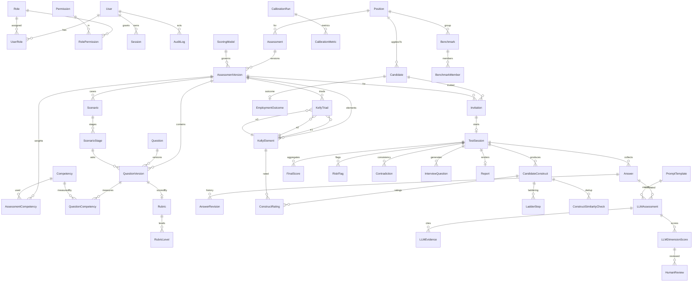

# DATABASE — модель данных PostgreSQL 16

## 1. Принципы

1. **Нормализация 3NF** для операционных сущностей; JSONB — только для
   версионированных снапшотов (rubric, порядок рандомизации, конфиг модели) и
   для полиморфного тела ответа кандидата.
2. **Immutability истории.** `AssessmentVersion` в статусе `PUBLISHED` не
   изменяется; `Answer` хранит текущее значение, `AnswerRevision` — все
   предыдущие; `AuditLog` — append-only.
3. **Никаких защищаемых характеристик.** В `Candidate` нет полей пол, возраст,
   национальность, религия, здоровье, семейное положение (§44).
4. **Явные FK + ON DELETE политика.** Кандидатские данные каскадируются при
   исполнении права на удаление; справочники — `RESTRICT`.
5. **Все денежные/балльные величины** — `Decimal(6,3)` (не float), чтобы
   scoring был воспроизводим.
6. **UUID v7-подобные ids** (`cuid2`) — сортируемость и отсутствие утечки
   объёма данных через инкрементные id.

## 2. ER-модель



## 3. Каталог сущностей

### 3.1. Доступ

| Сущность | Назначение | Ключевые поля |
|---|---|---|
| `User` | сотрудник Заказчика | `email` uniq, `passwordHash` (argon2id), `isActive`, `mfaSecret?` |
| `Role` | SuperAdmin / AssessmentAdmin / HR / TechnicalExpert / Viewer / Candidate | `code` uniq, `isSystem` |
| `Permission` | гранулярное право `resource:action` | `code` uniq, `description` |
| `RolePermission` | связь | PK (`roleId`,`permissionId`) |
| `UserRole` | связь | PK (`userId`,`roleId`) |
| `Session` | staff-сессия | `tokenHash` uniq, `expiresAt`, `ip`, `userAgent`, `revokedAt` |

### 3.2. Конфигурация ассессмента

| Сущность | Назначение | Ключевые поля |
|---|---|---|
| `Position` | должность | `code` uniq (`MUD_ENGINEER`, `IS_ENGINEER`, …), `title`, `family` |
| `Competency` | компетенция | `code` uniq, `title`, `axis` (одна из 8 осей §17), `isCritical` |
| `Assessment` | ассессмент должности | `positionId`, `code`, `title` |
| `AssessmentVersion` | **immutable после publish** | `version` int, `status` (DRAFT/PUBLISHED/ARCHIVED), `publishedAt`, `scoringModelId`, `promptTemplateId`, `llmModelPrimary`, `llmModelSecondary`, `configSnapshot` JSONB, `bandThresholds` JSONB, `disagreementThreshold` Decimal |
| `AssessmentCompetency` | вес компетенции в версии | `weight` Decimal(6,3), `isHardGate`, `minEvidenceCount` |
| `Question` | стабильная идентичность вопроса | `code` uniq, `type` (11 типов) |
| `QuestionVersion` | текст и настройки на версию | `assessmentVersionId`, `prompt`, `helpText`, `required`, `maxLength`, `numericUnit`, `options` JSONB, `orderIndex`, `isActive`, `difficulty`, `scenarioStageId?`, `section` |
| `QuestionCompetency` | что измеряет вопрос | `weightWithinCompetency` Decimal |
| `Rubric` | rubric вопроса/компетенции | `code`, `competencyId`, `version`, `guidance` |
| `RubricLevel` | уровни 0–4 | `level`, `descriptor`, `positiveIndicators` JSONB, `negativeIndicators` JSONB |
| `Scenario` | ситуационный кейс | `code`, `title`, `positionId`, `difficulty`, `equivalenceGroup`, `expectedEvidence` JSONB, `unsafeActions` JSONB, `expertNotes` |
| `ScenarioStage` | этап раскрытия информации | `stageIndex`, `situation`, `dynamics` JSONB, `constraints`, `adjacentServiceInfo`, `revealAfterStage` |
| `KellyElement` | E1–E10 (переопределяемые) | `code`, `label`, `description`, `isSelf`, `isIdeal`, `orderIndex` |
| `KellyTriad` | триада | `code`, `elementAId/BId/CId`, `orderIndex`, `randomizable` |
| `ScoringModel` | версия алгоритма агрегации | `code`, `version`, `params` JSONB, `description` |
| `PromptTemplate` | версия промпта | `code`, `version`, `role` (EVAL_A/EVAL_B/INTERVIEW_Q/DEDUP), `systemPrompt`, `userTemplate`, `jsonSchema` JSONB |

### 3.3. Кандидат и прохождение

| Сущность | Назначение | Ключевые поля |
|---|---|---|
| `Candidate` | минимальные PII | `fullName`, `email`, `positionId`, `experienceYears?`, `sourceChannel?`, `externalRef?`, `anonymizedAt?` |
| `ConsentRecord` | лог согласия | `candidateId`, `policyVersion`, `grantedAt`, `ip`, `text` |
| `Invitation` | приглашение | `tokenHash` uniq, `status`, `expiresAt`, `sentAt`, `openedAt`, `maxAttempts`, `attemptsUsed`, `createdByUserId` |
| `TestSession` | попытка | `assessmentVersionId` (снапшот!), `status`, `assessmentStatus` (NOT_STARTED/PENDING/IN_PROGRESS/DONE/FAILED), `startedAt`, `completedAt`, `randomSeed`, `sectionOrder` JSONB, `currentSection`, `currentQuestionId`, `progressPercent` |
| `Answer` | текущий ответ | `questionVersionId`, `valueJson` JSONB, `textValue` (для FTS), `numericValue?`, `status` (DRAFT/SUBMITTED/SKIPPED), телеметрия: `shownAt`, `firstInputAt`, `submittedAt`, `revisionCount`, `returnCount`, `focusLossCount`, `msActive` |
| `AnswerRevision` | история | `revision`, `valueJson`, `createdAt` |
| `SessionEvent` | техжурнал (вкладки, реконнекты) | `type`, `payload` JSONB, `serverTime` |

### 3.4. Kelly

| Сущность | Назначение | Ключевые поля |
|---|---|---|
| `CandidateConstruct` | персональный конструкт | `triadId?`, `poleLeft`, `poleRight`, `similarityExplanation`, `differenceExplanation`, `importanceReason`, `rigManifestation`, `experienceExample`, `similarPairElements` JSONB, `isDuplicateOf?`, `orderIndex` |
| `ConstructRating` | клетка решётки | (`constructId`,`elementId`) uniq, `rating` 1..7 |
| `LadderStep` | лестница смыслов | `constructId`, `depth`, `question`, `answer` |
| `ConstructSimilarityCheck` | вопрос о дублировании | `constructAId`, `constructBId`, `similarityScore` Decimal, `candidateVerdict` (SAME/DIFFERENT), `candidateExplanation` |
| `GridAnalysis` | результат математики | `sessionId`, `metrics` JSONB (расстояния, кластеры, поляризация), `computedAt`, `engineVersion` |

### 3.5. Оценка

| Сущность | Назначение | Ключевые поля |
|---|---|---|
| `LLMAssessment` | один прогон одного evaluator по одному ответу | `answerId`, `evaluatorRole` (A/B), `promptTemplateId`, `llmProvider`, `llmModel`, `llmModelVersion`, `rubricVersionRef`, `rawResponse` (text), `parsedJson` JSONB, `confidence` Decimal, `reviewRequired`, `status` (OK/INVALID_JSON/PROVIDER_ERROR), `attempt`, `latencyMs`, `promptTokens`, `completionTokens` |
| `LLMDimensionScore` | балл по компетенции внутри прогона | `competencyId`, `score` Decimal(3,2) nullable, `level` int nullable, `notEnoughEvidence` bool, `explanation`, `rubricRule`, `confidence` |
| `LLMEvidence` | доказательство | `dimensionScoreId`, `quote`, `quoteStartOffset?`, `kind` (SUPPORTING/MISSING/RISK/STRENGTH/AMBIGUITY) |
| `HumanReview` | экспертная проверка | `dimensionScoreId?`, `answerId?`, `competencyId`, `modelScore`, `humanScore`, `finalScore`, `reviewReason`, `markedUninformative`, `reviewerId`, `createdAt` |
| `FinalScore` | агрегат по компетенции и общий | `sessionId`, `competencyId?` (null = overall), `axis?`, `score0to4` Decimal, `score0to100` Decimal, `level` int, `confidence` Decimal, `evidenceCount`, `notEnoughEvidence`, `band`, `scoringModelId`, `computedAt`, `supersededAt?` (действующей считается запись с NULL), `supersededById?` (ссылка на заменившую запись) |
| `RiskFlag` | red flag | `sessionId`, `code`, `severity`, `answerId`, `quote`, `explanation`, `source` (LLM/RULE/HUMAN), `confirmedByUserId?` |
| `Contradiction` | расхождение декларация↔поведение | `sessionId`, `constructId?`, `answerIds` JSONB, `description`, `strength` Decimal |
| `InterviewQuestion` | вопрос к очному интервью | `sessionId`, `text`, `rationale`, `refAnswerIds` JSONB, `competencyId?`, `orderIndex` |
| `Report` | сгенерированный отчёт | `sessionId`, `format` (WEB/PDF), `storageKey`, `renderedAt`, `versionsSnapshot` JSONB |

### 3.6. Накопление и калибровка

| Сущность | Назначение |
|---|---|
| `EmploymentOutcome` | итог найма и испытательного срока; отдельное право `employment_outcome:write` |
| `Benchmark` / `BenchmarkMember` | внутренняя эталонная группа (top performers) |
| `CalibrationRun` / `CalibrationMetric` | MAE, bias, распределение расхождений, согласованность экспертов, частота override |
| `QuestionStat` | completion, avg, variance, корреляция с итогом компетенции, override rate, missing rate, флаг «требует методической проверки» |
| `AuditLog` | `actorUserId?`, `actorKind` (USER/CANDIDATE/SYSTEM), `action`, `entity`, `entityId`, `oldValue` JSONB, `newValue` JSONB, `ip`, `requestId`, `createdAt` — append-only |

## 4. Ключевые инварианты (проверяются в БД и тестами)

| Инвариант | Механизм |
|---|---|
| Сумма весов компетенций версии = 100 ± 0.01 | проверка в сервисе публикации + тест |
| `AssessmentVersion.status = PUBLISHED` → immutable | сервисный guard + trigger-тест `historicalVersionImmutable` |
| `TestSession.assessmentVersionId` не меняется | поле без update-пути в API |
| `ConstructRating.rating ∈ [1,7]` | CHECK constraint |
| `LLMDimensionScore`: `score IS NULL` ⟺ `notEnoughEvidence = true` | CHECK constraint |
| `RiskFlag.answerId` NOT NULL при `source = LLM` | CHECK constraint (§20: red flag всегда со ссылкой) |
| Один действующий `FinalScore` на (session, competency), на (session, axis) и один общий | partial unique index `WHERE "supersededAt" IS NULL`. Признак активности вынесен в отдельное поле: `supersededById` указывает на ещё не созданную запись и не может служить признаком внутри транзакции пересчёта |
| `Invitation.tokenHash` уникален; сам токен не хранится | uniq index, токен только в ответе на создание |
| `AuditLog` только INSERT | отсутствие update/delete в репозитории + revoke прав у app-роли (см. DEPLOYMENT) |

## 5. Индексы и полнотекстовый поиск

```sql
-- Поиск по кандидатам
CREATE INDEX candidate_fts_idx ON "Candidate"
  USING GIN (to_tsvector('russian', coalesce("fullName",'') || ' ' || coalesce(email,'')));

-- Поиск по ответам (textValue заполняется сервисом из valueJson)
CREATE INDEX answer_fts_idx ON "Answer"
  USING GIN (to_tsvector('russian', coalesce("textValue",'')));

-- Поиск по конструктам
CREATE INDEX construct_fts_idx ON "CandidateConstruct"
  USING GIN (to_tsvector('russian',
    coalesce("poleLeft",'') || ' ' || coalesce("poleRight",'') || ' ' ||
    coalesce("importanceReason",'') || ' ' || coalesce("rigManifestation",'')));

-- Поиск по экспертным комментариям
CREATE INDEX review_fts_idx ON "HumanReview"
  USING GIN (to_tsvector('russian', coalesce("reviewReason",'')));

-- Горячие пути
CREATE INDEX answer_session_idx        ON "Answer"("sessionId");
CREATE INDEX llm_answer_role_idx       ON "LLMAssessment"("answerId","evaluatorRole");
CREATE INDEX finalscore_session_idx    ON "FinalScore"("sessionId") WHERE "supersededAt" IS NULL;
CREATE INDEX auditlog_entity_idx       ON "AuditLog"("entity","entityId","createdAt" DESC);
CREATE INDEX session_status_idx        ON "TestSession"("status","assessmentStatus");
```

## 6. Retention и обезличивание (§44)

* `RetentionPolicy` в конфиге: срок хранения PII по умолчанию 24 месяца после
  завершения сессии; агрегаты и статистика — бессрочно, но обезличенно.
* Обезличивание: `Candidate.fullName → 'Кандидат #<seq>'`, `email → NULL`,
  `anonymizedAt = now()`; `Answer.textValue` сохраняется (профессиональное
  содержание), но цитаты, содержащие ФИО, не создаются — промпт запрещает
  извлекать персональные данные третьих лиц.
* Экспорт данных кандидата: `GET /api/candidates/:id/export?format=json` —
  полный дамп его данных (право `candidate:export_personal`).
* Удаление: `POST /api/candidates/:id/erase` — каскад по кандидатским таблицам,
  запись в `AuditLog` (сам audit-запись не удаляется).
