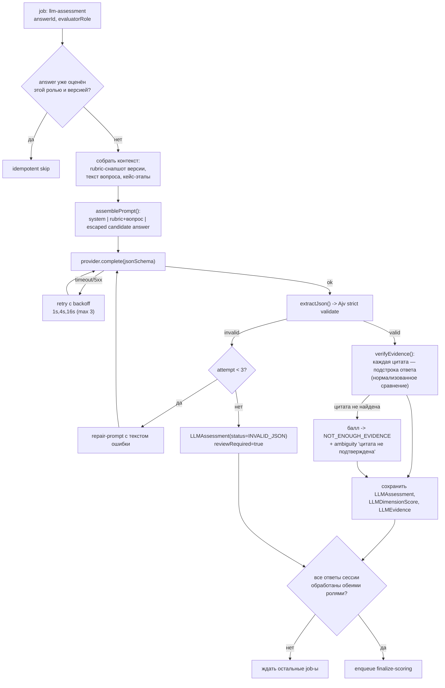

# LLM ASSESSMENT ENGINE

## 1. Принципы

1. LLM **не выставляет итоговую оценку**. Она даёт суждение по одному ответу
   кандидата в терминах rubric, с обязательными доказательствами. Агрегацию,
   веса, hard-gates, band и confidence считает детерминированный код (§SCORING).
2. Каждый автоматический вывод должен быть проверяем (§66): балл без цитаты из
   ответа кандидата отбрасывается.
3. Модель не додумывает знания кандидата (§15). Отсутствие доказательств →
   `NOT_ENOUGH_EVIDENCE`, **не ноль**.
4. Ответ кандидата — недоверенные данные (§40, см. SECURITY §4).
5. Платформа работает при недоступности LLM (§74).

## 2. Абстракция провайдера (§38)

```ts
export interface LLMProvider {
  readonly name: 'openai' | 'anthropic' | 'openrouter' | 'local' | 'noop';
  complete(req: LLMRequest): Promise<LLMResponse>;   // structured JSON output
}

export interface LLMRequest {
  model: string;
  system: string;
  messages: Array<{ role: 'user' | 'assistant'; content: string }>;
  jsonSchema: JSONSchema;        // строгий контракт выхода
  schemaName: string;
  maxOutputTokens: number;
  temperature: number;           // 0 для оценки
  timeoutMs: number;
}

export interface LLMResponse {
  text: string;                  // сырой ответ (хранится для аудита)
  parsed: unknown | null;        // если провайдер сам вернул объект
  model: string;
  modelVersion?: string;
  usage: { promptTokens?: number; completionTokens?: number };
  latencyMs: number;
}
```

Реализации: `OpenAIProvider` (native structured outputs), `AnthropicProvider`
(tool-schema), `OpenRouterProvider` (OpenAI-совместимый), `LocalProvider`
(OpenAI-совместимый эндпоинт, например vLLM/llama.cpp server),
`NoopProvider` (для окружений без LLM: возвращает управляемую ошибку, задача
остаётся в статусе `PENDING`, сессия не теряется).

Фабрика `createProvider(env)` — единственная точка выбора; ключи только из env.

## 3. Роли оценщиков

| Роль | Промпт | Модель |
|---|---|---|
`EVAL_A` | «инженер-эксперт по rubric»: строгое следование уровням 0–4 | `LLM_MODEL_PRIMARY` |
`EVAL_B` | «независимый рецензент»: другая формулировка задачи, требование отдельно проверить отсутствие доказательств | `LLM_MODEL_SECONDARY` (может совпадать с primary, но промпт иной) |
`INTERVIEW_Q` | генерация 5–10 вопросов к интервью со ссылками на ответы | primary |
`DEDUP` | семантическая близость двух конструктов | быстрая/дешёвая модель |
`CONSTRUCT_MAP` | сопоставление конструкта с кодами компетенций (с цитатой) | primary |

Все промпты — записи `PromptTemplate` (версионируются, редактируются
администратором с audit-записью).

## 4. Контракт выхода (JSON Schema, §15/§39)

```json
{
  "type": "object",
  "additionalProperties": false,
  "required": ["dimension_scores","evidence","missing_evidence","risk_flags",
               "strengths","ambiguities","confidence","review_required"],
  "properties": {
    "dimension_scores": {
      "type": "array",
      "items": {
        "type": "object", "additionalProperties": false,
        "required": ["competency_code","score","not_enough_evidence",
                     "explanation","rubric_rule","confidence","evidence_quotes"],
        "properties": {
          "competency_code": { "type": "string", "enum": ["…из версии ассессмента…"] },
          "score": { "type": ["integer","null"], "minimum": 0, "maximum": 4 },
          "not_enough_evidence": { "type": "boolean" },
          "explanation": { "type": "string", "maxLength": 1200 },
          "rubric_rule": { "type": "string", "maxLength": 400 },
          "confidence": { "type": "number", "minimum": 0, "maximum": 1 },
          "evidence_quotes": {
            "type": "array", "maxItems": 5,
            "items": { "type": "string", "minLength": 10, "maxLength": 600 }
          }
        }
      }
    },
    "evidence":        { "type": "array", "items": { "$ref": "#/$defs/citation" } },
    "missing_evidence":{ "type": "array", "items": { "type": "string", "maxLength": 300 } },
    "risk_flags": {
      "type": "array",
      "items": { "type": "object", "additionalProperties": false,
        "required": ["code","quote","explanation","severity"],
        "properties": {
          "code": { "type": "string", "enum": ["…каталог red flags…"] },
          "quote": { "type": "string", "minLength": 10 },
          "explanation": { "type": "string" },
          "severity": { "type": "string", "enum": ["LOW","MEDIUM","HIGH"] } } } },
    "strengths":  { "type": "array", "items": { "$ref": "#/$defs/citation" } },
    "ambiguities":{ "type": "array", "items": { "type": "string" } },
    "confidence": { "type": "number", "minimum": 0, "maximum": 1 },
    "review_required": { "type": "boolean" }
  },
  "$defs": {
    "citation": { "type": "object", "additionalProperties": false,
      "required": ["quote","comment"],
      "properties": { "quote": { "type": "string", "minLength": 10 },
                      "comment": { "type": "string" } } }
  }
}
```

## 5. Пайплайн обработки одного ответа



### 5.1. Нормализация цитат

Сравнение цитаты с ответом: нижний регистр, схлопывание пробелов, унификация
кавычек/дефисов, удаление концевой пунктуации. Допускается совпадение по
нормализованной подстроке либо покрытие ≥90% токенов подряд идущим окном
(защита от многоточий модели). Иначе цитата считается непроверенной.

### 5.2. Отказ LLM (§74)

* `TestSession.assessmentStatus` = `PENDING` — сессия сохранена полностью;
* job уходит в retry с backoff, затем в delayed-очередь (проверка раз в 10 мин);
* провайдер `none`/недоступен → задачи остаются в очереди, UI показывает
  «Оценка ожидает обработки»; HR может открыть ответы кандидата и провести
  полностью ручную оценку через human review;
* после восстановления очередь обрабатывается; ни одна сессия не теряется.

## 6. finalize-scoring

1. Загрузить все `LLMDimensionScore` + `HumanReview` сессии.
2. `combineEvaluators` → `applyHumanReview` → `calculateCompetencyScore`.
3. `detectRuleFlags` (детерминированные правила) + LLM-флаги с проверенными цитатами.
4. `detectCriticalGaps`, `detectCrossAnswerContradictions`, `computeGridMetrics`.
5. `calculateAxisScores`, `calculateAssessmentScore`, `resolveBand`.
6. Записать `FinalScore` (новые записи, старые — `supersededById`), `RiskFlag`,
   `Contradiction`, `GridAnalysis`.
7. Если `reviewRequired` — поставить сессию в очередь human review.
8. Сгенерировать `InterviewQuestion` (job `interview-questions`).
9. Audit-запись `SCORING_COMPUTED` с версиями всех компонентов.

## 7. Генерация вопросов к интервью (§46)

Вход: топ-конструкты, противоречия, hard-gates, компетенции с низким
confidence, `missing_evidence`. Требование схемы: каждый вопрос содержит
`ref_answer_ids` (непустой) и `rationale`. Вопрос без ссылки на фактический
ответ отбрасывается валидатором. Количество — 5–10; при недостатке материала
генерируется меньше, дополнение — правилами (шаблон по каждому hard-gate).

## 8. Бюджеты и защита

`LLM_MAX_CONCURRENCY` (по умолчанию 4), `LLM_TIMEOUT_MS` (60000),
`LLM_MAX_RETRIES` (3), лимит `maxOutputTokens` (2000), максимальная длина
ответа кандидата в промпте 12000 символов, максимум job-ов на сессию =
`2 × количество открытых ответов + 3`. Превышение — job падает в DLQ с
`reviewRequired = true`, а не бесконечно повторяется.

## 9. Тестирование

* `tests/llm/schema.test.ts` — валидные/невалидные выходы, repair-retry;
* `tests/llm/evidence.test.ts` — отбрасывание непроверенных цитат;
* `tests/llm/injection.test.ts` — ответ с «Ignore previous instructions…» не
  повышает балл и порождает `SessionEvent`;
* `tests/llm/provider.test.ts` — контракт всех провайдеров на моках,
  `NoopProvider` оставляет статус `PENDING`;
* детерминированный `FakeProvider` используется в интеграционных и e2e тестах —
  реальные сетевые вызовы в CI отсутствуют.
